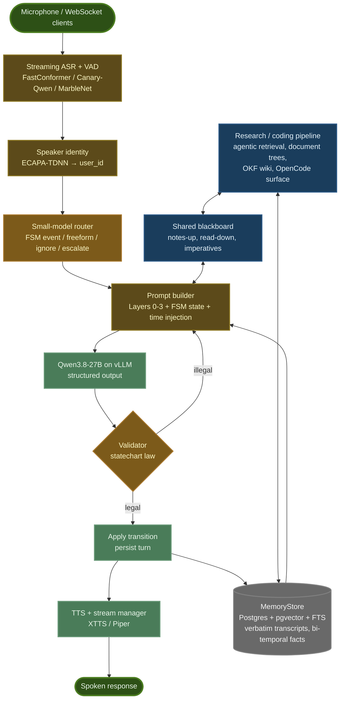
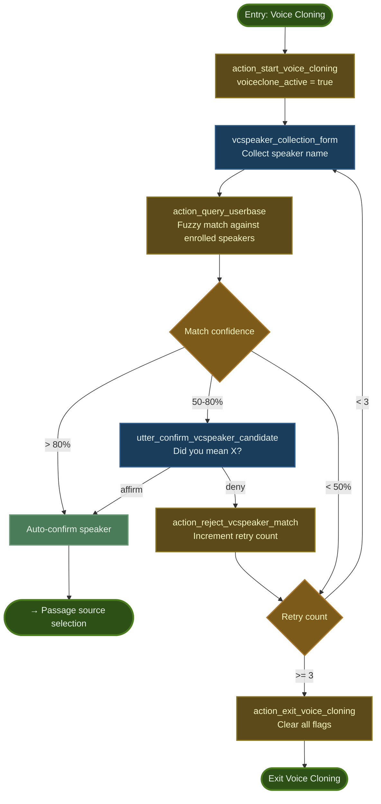

# Fawkes

**A self-hosted, voice-native, multi-user AI assistant with a memory that never forgets and always cites its sources.**

Fawkes runs entirely on local hardware. It listens on any microphone, knows who is speaking, remembers every conversation verbatim with timestamps, and reasons over that memory with a hierarchical state machine driving a local large language model. It is built around one conviction: an assistant is only as good as its memory, and memory is an architecture, not a feature.

---

## What Fawkes is

- **Voice-first.** Streaming speech recognition, voice-activity detection, speaker identification, and cloned-voice synthesis, end to end, on owned GPUs.
- **Person-centric.** Memory is keyed to the *speaker*, resolved from voice (ECAPA-TDNN embeddings), across every session and device, never to a chat session. Multiple users are a hard requirement at every stage.
- **Memory-first.** A PostgreSQL system of record holds verbatim, timestamped transcripts and a bi-temporal facts table (when a fact was true, when it was learned), with hybrid lexical + semantic retrieval inside the same transactional boundary. Summaries and compiled knowledge are overlays that link back to sources and never replace them.
- **Statechart-driven.** Multi-step workflows (enrollment, voice cloning, authentication) are Harel statecharts. The language model *proposes* transitions; a deterministic validator *ratifies* them. No closed-set intent classifier ever gates the conversation.
- **Two pipelines, one brain.** A latency-critical voice loop (deterministic lookups and single-shot retrieval only) runs alongside a research/coding pipeline (agentic retrieval, multi-hop reasoning, document trees, a compiled wiki), with a shared blackboard between them.
- **Local by default.** Everything runs on the workstation; cloud calls are explicit, budget-gated, and logged.

## Architecture



### Workflow depth: one excerpt

Every multi-step flow is specified as a diagram before it is coded. The excerpt below is the speaker-selection stage of the voice-cloning workflow from Iteration 1: fuzzy-match confidence decides whether the system auto-confirms, asks, or retries, and three failed retries abort cleanly.



The complete Iteration-1 flowcharts (enrollment name collection with spelling confirmation, pangram recording, and the full voice-cloning loop) are in [`docs/diagrams/iteration1/`](docs/diagrams/iteration1/); earlier drafts are in [`docs/diagrams/iteration1/archive/`](docs/diagrams/iteration1/archive/). The architecture diagram above is maintained as [`docs/diagrams/architecture.mermaid`](docs/diagrams/architecture.mermaid). Iteration-2 statecharts will be added under `docs/diagrams/iteration2/` alongside the code that implements them.

## Design principles (abridged)

1. One ACID system of record; everything else is derived and rebuildable.
2. Verbatim first; synthesis is an overlay with provenance.
3. Time is not optional: every turn, fact, and resource is timestamped, and elapsed time is injected into every prompt.
4. One write path (`ingest()`): hashed, idempotent, provenance-stamped.
5. Transformations leave receipts: manifests on compression, traces on retrieval.
6. Epistemic hygiene: cite the source, or say "I don't know."
7. Latency class determines retrieval class: the voice loop never waits on an LLM-driven search.
8. The LLM proposes; deterministic code ratifies.
9. Adopt at the edges, build the core: the statechart, memory substrate, and identity system are built; coding harnesses and serving runtimes are adopted behind seams.
10. Measure, don't debate: an evaluation harness is a component of the system.

The complete twenty-principle manifesto is [`docs/Fawkes_Guiding_Principles.md`](docs/Fawkes_Guiding_Principles.md). The rest of the design set lives beside it: [wishlist](docs/Fawkes_Wishlist_v2.md), [systems inventory](docs/Fawkes_Systems_Inventory.md), [implementation plan](docs/Fawkes_Implementation_Plan.md), [toolbox](docs/Fawkes_Toolbox.md), and [session handoff](docs/Fawkes_Session_Handoff.md).

## Technical highlights from Iteration 1

- Domain-size-adaptive speaker confidence scoring: the similarity-gap weight scales inversely with the number of enrolled speakers.
- In-memory ECAPA embedding matrix with vectorized cosine similarity for sub-millisecond speaker matching.
- Multi-factor no-match scoring combining utterance duration, domain size, similarity gap, and z-score outlier detection over the full similarity distribution.
- Cumulative incremental voice imprints: enrollment embeddings are duration-weighted averages over multiple samples with tracked sample counts.
- Retroactive transcript editing (`retroedit_id`) for in-place correction of streamed words as final transcription lands.
- Intent-agnostic, context-aware slot capture that used rule position rather than intent classification to route enrollment steps around NLU unreliability.
- Sequential TTS queue with input muting until the outgoing queue drains, preventing the assistant from transcribing its own voice.

## Stack

| Layer | Technology |
|---|---|
| Speech | NVIDIA NeMo (FastConformer, Canary-Qwen, MarbleNet), ECAPA-TDNN, XTTS / Piper |
| Cognition | Qwen3.8-27B (Int4) on vLLM; Qwen 4B router; hierarchical statechart + validator |
| Memory | PostgreSQL + pgvector + full-text search; bi-temporal facts; hybrid retrieval with Reciprocal Rank Fusion |
| Research / coding | Agentic retrieval loop, PageIndex-style document trees, OKF-conformant wiki, OpenCode, MCP server |
| Infrastructure | Docker Compose, FastAPI, asyncio, GitHub Actions CI, pytest eval harness |

## Implementation status

**Iteration 1 — Rasa-based voice assistant (complete, frozen)**
- [x] Streaming ASR with interim and final transcription (FastConformer interim, Canary-Qwen final)
- [x] Voice-activity detection and endpointing (MarbleNet)
- [x] Speaker enrollment and identification (ECAPA-TDNN, incremental imprints)
- [x] Voice cloning (XTTS conditioning latents, Piper fallback)
- [x] Multi-client WebSocket server with class-based architecture (`canary/server03f.py`)
- [x] Rasa-driven enrollment and voice-cloning workflows with fuzzy-matched name and passage selection
- [x] DuckDB speaker, pangram, and passage store

**Iteration 2 — LLM + statechart rebuild (in progress)**

- [ ] **Phase 0 — Milestone Zero** (first running code)
  - [ ] Postgres + pgvector service in Docker Compose
  - [ ] Migration 001: transcripts, bi-temporal facts, documents; full-text and vector indexes; enum seed tables
  - [ ] `MemoryStore` skeleton: `remember_utterance()`, `recall()` with hybrid BM25 + vector and Reciprocal Rank Fusion
  - [ ] First pytest: three utterances in, retrieved by meaning and by keyword, timestamps and provenance asserted; transcript survives a container restart
- [ ] **Phase 1 — Cognitive core and substrate foundation** (text mode; Iteration 1 keeps running)
  - [ ] Prompt builder with current-time and elapsed-time injection; validator skeleton; structured-output JSON contract; FSM registry data structures
  - [ ] Small-model router v1 (advance-FSM / freeform / ignore / escalate, with confidence) in front of the 27B
  - [ ] Serving: vLLM for Qwen3.8-27B on the RTX 3090; llama.cpp for the 4B router + embedder on the GTX 1660 Super; cache-stable prompt prefix
  - [ ] Ontology v1 (entity, relation, and facet vocabulary as enum tables and constraints) before the facts table takes data
  - [ ] `ingest()` v1 with content hashing and provenance; one JSON trace per turn; Postgres backup cron
  - [ ] Eval harness v0 (about 30 seeded questions, behavioral checks, latency timing) on the workstation
  - [ ] CI on GitHub Actions: unit tests for the deterministic core, Postgres integration tests, mocked-LLM FSM walkthroughs via a shared `FakeLLM` fixture; phase exits as permanent pytest markers
- [ ] **Phase 2 — Voice memory and identity** (voice becomes primary; Rasa retired)
  - [ ] Tiered context loading (Layers 0-2), semantic cache, Layer-3 tool calls (remember, recall, single-shot lookups)
  - [ ] Enrollment and voice-clone statecharts ported; authentication statechart with deferred identification tiers and passphrase
  - [ ] Operational data migration: DuckDB speakers, imprints, pangrams, and passages into Postgres; DuckDB retired
  - [ ] Voice register: thinking off or budgeted, brevity persona, stall words; correction-event hook into the prompt builder
  - [ ] Per-turn memory-promotion hook on the small model; sandboxed tool container
  - [ ] Rasa switched off once lifecycle tests and eval slices pass; two speakers hold personalized conversations on separate devices
- [ ] **Phase 3 — Ingestion, research pipeline, external hands, dual-pipeline interplay**
  - [ ] Ingestion router with structure scoring and Qwen-vision OCR; PageIndex-style document trees with checksum caching
  - [ ] Research pipeline v1: agentic loop (grep, FTS, tree, web), CRAG grading, recall ladder with citations, checkpoints to `MemoryStore`
  - [ ] Rubber-duck interplay v1: shared blackboard, notes-up, read-down status board, imperative channel, 4B arbiter (discard / queue / interrupt)
  - [ ] Consolidation and compaction jobs with an idle-window scheduler
  - [ ] OpenCode as coding surface on the local endpoint; MCP server over `MemoryStore` with scoped auth and audit log; budget-gated Claude escalation tool
  - [ ] Salience weights v1 and contradiction detector v1 (log level); state-space-model ASR swap around Phase 3.5 as VRAM allows
- [ ] **Phase 4 — Synthesis layer, second GPU, measured experiments**
  - [ ] OKF-conformant wiki distillation layer with lifecycle states and lint cron
  - [ ] Tunnel manager (cross-project scope weights) and contradiction escalation to a clarification statechart
  - [ ] Gemma 4 on the second RTX 3090 as conversational and second-opinion model; listening tests against tuned Qwen
  - [ ] Heads-down mode: conversational slot handed to a second coding model by task mode
  - [ ] Reconciliation crons and type histograms
  - [ ] Benchmarks recorded in the toolbox: wiki vs Cog-RAG, hand-rolled research loop vs deepagents, Harness-1 as retrieval subagent
- [ ] **Phase 5 — Web interface, multi-surface, back-catalog**
  - [ ] Web app: chat, uploads, project notes, authentication and sessions, security hardening pass
  - [ ] Row-level security scoping per user and per project; voice-driven project management
  - [ ] Back-catalog import of Iteration-1 logs and Claude/ChatGPT exports through an `ingest()` adapter with project assignment
  - [ ] Mobile-facing API and Claude handoff bundles
- [ ] **Phase 6+ — Frontier** (planned, not scheduled): state-space-model ASR if not already swapped, digests and scrape crons, home automation, computer vision, Graphiti if bi-temporal SQL hits its ceiling

## Research directions

- **Speaker separation ("cocktail party")**: a separate research track and repository; results will feed Fawkes's speech stack.
- **State-space-model ASR**: replacing transformer ASR with Mamba-class streaming models for constant-memory, low-latency transcription.
- **Retrieval policy**: measured comparisons of compiled-wiki, hypergraph, and agentic retrieval on a personal research corpus.

## Getting started

Requirements: Docker with the NVIDIA container toolkit, one CUDA-capable GPU (developed on an RTX 3090), a host directory `~/fawkes` holding model weights (`models/coqui_xtts/XTTS-v2/`, `models/ecapa_tdnn_embed/ecapa_tdnn.nemo`) and audio samples (mounted into the container at `/root/fawkes`), and a sibling directory `../fawkes_private/` outside the repository holding the speaker database (`speakers/database.duckdb`) and the Postgres secrets (`secrets/pg_password.txt`, `secrets/pg_url.txt`), mounted at `/workspace-private` and `/run/secrets`.

```bash
docker compose up -d                       # postgres, fawkes (Iteration 2); canary, rasa-nlp, rasa-actions (Iteration 1)
docker compose exec canary python3 server03f.py      # Iteration-1 voice server
docker compose exec fawkes pytest                     # Iteration-2 test suite
```

The voice server listens for WebSocket clients on port 9001 and serves its HTTP API on 9002; Postgres is on 5432; the companion browser client lives in the `fawkes-frontend` repository. Two Dev Containers configurations are provided: `fawkes` for Iteration-2 work and `canary` for the Iteration-1 server; both open the repository root as `/workspace`.

Rasa maintenance:

```bash
docker compose exec rasa-nlp rasa train --force --debug          # retrain after editing legacy/iteration1/rasa-nlp/
docker restart rasa-nlp rasa-actions                            # reload the trained model
docker compose exec rasa-nlp rasa shell --port 5007 --debug     # interactive test shell
docker logs -f rasa-nlp                                         # follow logs
docker compose up -d --force-recreate --no-deps --build rasa-nlp   # rebuild one service
```

Operational notes:

- Rasa's training cache runs on a tmpfs ramdisk (see `docker-compose.yml`); SQLite's atomic writes do not survive Docker volumes bridging the Windows virtualization layer.
- If Docker is shut down uncleanly, `rm .git/index.lock` may be needed before git works again.
- Docker "rebuild" can silently reuse a cached broken image; `docker system prune -a` forces a genuine rebuild.
- `watch -n 1 nvidia-smi` tracks GPU memory live.

## Repository layout

| Path | Contents |
|---|---|
| `src/fawkes/` | Iteration-2 package: `speech/`, `memory/`, `cognition/` (with `fsm/`), `server/`, `eval/`. Scaffolded; Phase 0 lands in `memory/` |
| `migrations/` | Plain-SQL schema migrations, applied in order |
| `tests/` | `unit/`, `integration/` (live Postgres), `functional/` (statechart walkthroughs against a mock model); phase exits are permanent markers |
| `docs/` | The six living design documents; `docs/diagrams/` holds the architecture diagram and the workflow flowcharts |
| `infra/` | `docker/fawkes.Dockerfile`, `postgres/init.sql` |
| `docker-compose.yml`, `.devcontainer/` | `postgres`, `fawkes`, and the Iteration-1 services on one network; Dev Containers configs for `fawkes` and `canary` |
| `legacy/iteration1/` | The frozen Iteration-1 system: `canary/` (voice server, speaker tooling, earlier code generations), `rasa-nlp/`, `rasa-actions/` |

## License

Not yet chosen. All rights reserved until a license file is added.
